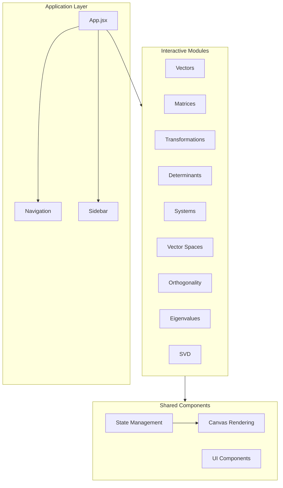
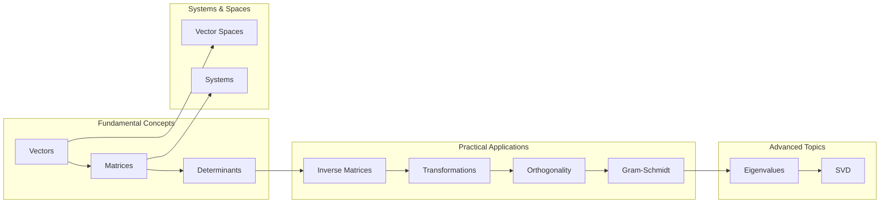
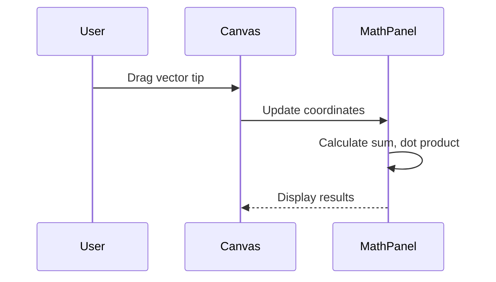
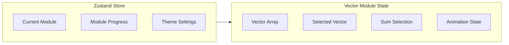

# LinearVis - Interactive Linear Algebra Visualizer

LinearVis is a high-fidelity, interactive web application designed to help students, educators, and researchers build a deep, intuitive geometric understanding of Linear Algebra.

Rather than treating linear algebra as dry algebraic formulas and symbol-pushing, LinearVis bridges the gap between numbers and space, allowing users to touch, drag, transform, and decompose mathematical objects in real time.

---

## Architecture Overview



---

## Module Overview



---

## Core Features

### Vectors Module

The Vectors module provides foundational linear algebra visualization with:

- **Real-time Manipulation**: Drag vector tips on an interactive coordinate grid
- **Vector Operations**: Addition, dot product, and angle calculations between any two vectors
- **Sum Animation**: Step-by-step visualization of tip-to-tail vector addition
- **Guided Learning**: Interactive card deck for beginners covering core concepts



### Matrix Operations

- Matrix-vector and matrix-matrix multiplication visualization
- Step-by-step arithmetic grids showing dot product alignments
- Visual transpose and property demonstrations

### Linear Transformations

- Apply arbitrary 2x2 matrices to standard shapes
- Dynamic animations of shear, rotation, scaling, and reflection
- Real-time coordinate tracking

### Determinants

- Watch unit area scale, flip, or collapse
- Clear visualization of orientation and singularity conditions

### Vector Spaces

- Explore span, basis, and linear independence concepts
- Watch span collapse as basis vectors become collinear

### Orthogonality & Gram-Schmidt

- Interactive vector projection
- Step-by-step orthogonalization animation

### Eigenvalues & Eigenvectors

- Drag test vectors to explore eigenvector behavior
- Real-time characteristic equation tracing

### SVD Decomposition

- Three-stage visualization of A = U Sigma V^T
- Interactive representation of rotation, scaling, and second rotation

---

## Design System

LinearVis uses the **Plume Design System** with the following principles:

### Color Palette

```css
/* Paper / Background */
--color-paper: oklch(97% 0.010 70);

/* Text & Accents */
--color-ink: oklch(26% 0.010 50);
--color-accent: oklch(52% 0.150 195);
--color-sum: oklch(58% 0.130 300);

/* Semantic Colors */
--color-emerald: oklch(52% 0.160 155);
--color-red: oklch(52% 0.160 25);
```

### Typography

- **Display**: Satoshi / Geist
- **Body**: Geist / Satoshi
- **Monospace**: Geist Mono / JetBrains Mono

### Responsive Layout

- Fluid flex panels with adaptive sidebars
- High-performance ResizeObserver for dynamic sizing
- KaTeX-powered mathematical typesetting

---

## Getting Started

### Prerequisites

- Node.js v18 or higher
- npm or yarn package manager

### Installation

```bash
# Clone the repository
git clone https://github.com/your-username/LinearVis.git
cd LinearVis

# Install dependencies
npm install

# Start development server
npm run dev
```

### Build for Production

```bash
npm run build
```

The production build is output to the `dist/` directory as a minified, optimized bundle.

---

## State Management Architecture



The application uses Zustand for global state management, with each module maintaining its own local state for interactive operations.

---

## License

LinearVis is distributed under a non-commercial, educational license:

**Permitted:**
- Personal study and academic research
- Classroom and virtual course demonstrations
- Forking and modifying for educational purposes

**Prohibited:**
- Commercial use or monetization
- Inclusion in paid courses or subscriptions
- Ad-supported hosting

---

## Contributing

Contributions are welcome. Please ensure any changes align with the design system tokens defined in `src/index.css`.

### Development Workflow

1. Create a feature branch
2. Make changes with proper ESLint compliance
3. Test with `npm run dev`
4. Build to verify production compatibility
5. Submit a pull request